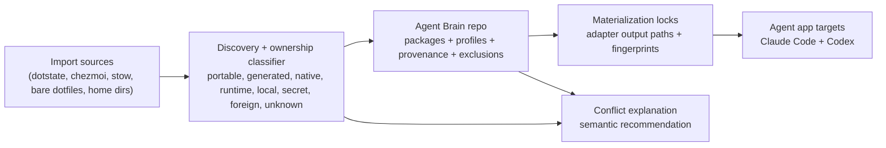
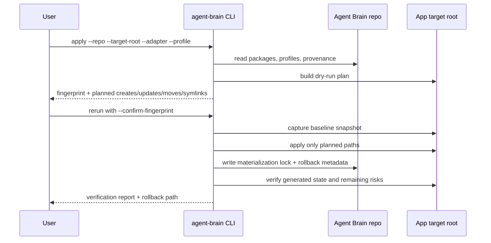
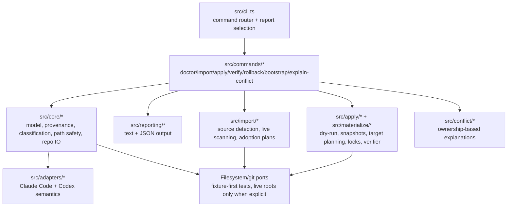

# Agent Brain

[](https://www.npmjs.com/package/@leonardsellem/agent-brain)

Agent Brain is a git-backed package and profile manager for portable AI coding-agent capabilities. It helps you turn messy local agent state into a canonical model of packages, profiles, provenance, exclusions, and target materialization.

The first target is the power-user migration problem: useful Claude Code and Codex setups often accumulate skills, plugins, prompts, app config, symlinks, dotfiles, caches, generated files, and local overrides faster than anyone can explain what owns what. Agent Brain makes that state legible before it mutates anything.

## Why Agent Brain

Agent Brain is not a dotfiles mirror. Dotstate, chezmoi, stow, bare dotfiles repositories, and unmanaged home directories can all be import sources, but the durable product model is portable agent capability intent.

That distinction matters because coding-agent apps have their own semantics. A Claude Code skill, a Codex plugin, app-native config, generated schema, runtime cache, auth file, and local machine override should not be treated as equivalent text files just because they live under a home directory.

Agent Brain is built around three ideas:

- **Explain ownership first.** Every scanned artifact is classified before it can become canonical source.
- **Keep intent portable.** Packages and profiles live in the Agent Brain repo; local apps are materialization targets.
- **Make live changes reversible.** Apply flows are designed around dry-runs, fingerprints, snapshots, verification, and rollback.

## What It Manages

The canonical model is deliberately smaller than an app home directory:

- **Packages** describe portable capability source such as skills, plugins, prompts, MCP definitions, or app connector intent.
- **Profiles** choose packages and adapter targets for a working setup.
- **Provenance** records where an item came from, which adapter observed it, how it was classified, and how confident the importer was.
- **Exclusions** explain why runtime, cache, auth, secret, local-only, app-native, foreign, or unknown files are not canonical package source.
- **Materialization locks** map canonical package intent to generated target paths for a specific adapter and target root.

Claude Code and Codex are the MVP adapters. Their layouts can diverge while still sharing Agent Brain's ownership vocabulary.

## Visual Overview

These diagrams combine the current repository architecture generated with `architecture-diagram-generator` and the product model captured in the Agent Brain project notes. For the raw generated module map, see [architecture generator output](docs/diagrams/architecture-generator-output.md) and the [interactive dashboard](docs/diagrams/architecture-generator-output.html).

### Product Model



### Safe Live Apply Transaction



### Current Implementation Modules



## Ownership Vocabulary

Agent Brain reports diagnosis, import, verification, and conflict results using the same categories everywhere:

| Category | Meaning |
| --- | --- |
| `portable-source` | Human-authored capability source that can be adopted into the Agent Brain repo. |
| `generated-target` | Output materialized from canonical Agent Brain intent into an app target. |
| `native-owned` | App-owned configuration or state that should be managed through the app's own semantics. |
| `runtime-cache` | Cache, history, generated schema, or runtime data that should not become portable source. |
| `machine-local` | Local overrides or machine-specific paths that should not be blindly synced. |
| `secret` | Auth material or secret-like content. Excluded unless explicitly classified safe. |
| `foreign-owned` | Files owned by another tool or source of truth. |
| `unknown` | Anything that requires human review before adoption or mutation. |

## Command Surface

```bash
agent-brain doctor
agent-brain import
agent-brain plan
agent-brain apply
agent-brain verify
agent-brain rollback
agent-brain bootstrap
agent-brain explain-conflict <path>
```

All commands support text output by default and structured output with `--json` where reports are returned.

| Command | Purpose |
| --- | --- |
| `doctor` | Scan known agent-app surfaces and explain ownership risks. |
| `import` | Convert portable source candidates into canonical package/profile output. |
| `plan` | Show proposed adoption or apply changes before writing. |
| `apply` | Materialize approved Agent Brain state into target app roots. |
| `verify` | Check generated target state and remaining risks. |
| `rollback` | Restore from snapshot metadata. |
| `bootstrap` | Materialize a second-machine target from an Agent Brain repo. |
| `explain-conflict` | Classify a conflicted path and recommend a semantic resolution. |

The current implementation supports both a fixture-backed preview path and an explicit live path for disposable or user-approved roots. Live commands require explicit roots, adapter/profile selection, a dry-run fingerprint, a baseline snapshot, a materialization lock, verify, rollback, and bootstrap evidence before the target is considered healthy.

## Safety Model

Live target mutation is treated as a transaction:

1. Start from explicit roots supplied on the command line.
2. Build a dry-run plan with every create, update, move, and symlink change.
3. Compute a dry-run fingerprint for that exact operation set.
4. Require explicit confirmation of the fingerprint.
5. Capture a baseline snapshot before mutation.
6. Apply only the paths listed in the dry-run.
7. Write a materialization lock.
8. Verify target state.
9. Keep rollback metadata.

Runtime state, caches, auth material, secret-like content, and machine-local overrides are excluded from canonical source by default.

## Quick Start

Prerequisites:

- Node.js 20 or newer
- npm

Install the CLI from npm:

```bash
npm install -g @leonardsellem/agent-brain
agent-brain --help
```

Run against a disposable or explicitly approved setup first. Live commands require explicit roots, dry-run fingerprint confirmation, a baseline snapshot, a materialization lock, verify, rollback, and bootstrap evidence before a target is considered healthy.

Run the live release path against disposable roots:

```bash
agent-brain doctor --claude-root tmp/live-claude --codex-root tmp/live-codex --source-root tmp/live-source --json
agent-brain import --source-root tmp/live-source --repo tmp/agent-brain-live --json
agent-brain apply --repo tmp/agent-brain-live --target-root tmp/live-target --adapter claude-code --profile profile.default --json
agent-brain apply --repo tmp/agent-brain-live --target-root tmp/live-target --adapter claude-code --profile profile.default --confirm-fingerprint sha256:from-dry-run --json
agent-brain verify --repo tmp/agent-brain-live --target-root tmp/live-target --adapter claude-code --json
agent-brain rollback --snapshot tmp/agent-brain-live/.agent-brain/snapshots/snap-from-dry-run.json --target-root tmp/live-target --json
agent-brain bootstrap --repo tmp/agent-brain-live --target-root tmp/live-target-b --adapter claude-code --profile profile.default --json
```

Use disposable roots first. The same safety gates apply to real app roots: explicit roots, dry-run fingerprint, baseline snapshot, materialization lock, verify, rollback, and bootstrap from canonical intent rather than copying full app homes.

### Contributor Setup

Install dependencies and run the full local verification loop from a source checkout:

```bash
npm install
npm test
npm run typecheck
npm run build
```

Run the compiled CLI against the synthetic release fixture:

```bash
npm run build
node dist/cli.js --help
node dist/cli.js doctor --fixture tests/fixtures/e2e-persona/scannable.json
node dist/cli.js plan --fixture tests/fixtures/e2e-persona/scannable.json --json
node dist/cli.js import --fixture tests/fixtures/e2e-persona/scannable.json --repo tmp/agent-brain-preview
node dist/cli.js apply --fixture tests/fixtures/e2e-persona/scannable.json --target-root /synthetic/target --json
node dist/cli.js verify --fixture tests/fixtures/e2e-persona/scannable.json --target-root /synthetic/target --json
node dist/cli.js rollback --json
node dist/cli.js explain-conflict '~/.codex/history.jsonl'
node dist/cli.js explain-conflict '~/.claude/skills/review/SKILL.md' --json
```

`apply` reports a dry-run fingerprint unless you pass the exact `--confirm-fingerprint` value from that dry-run. `rollback` fails until snapshot metadata is supplied; that is intentional and prevents a missing rollback record from looking successful.

## Development

This repository is optimized for agent-native development:

- Plan before coding.
- Write or update a failing test before behavior changes.
- Keep filesystem, git, and process effects behind ports so tests can run against fixtures.
- Treat Claude Code and Codex app homes as materialization targets, not as the canonical Agent Brain source of truth.
- Run `npm test` and `npm run typecheck` before handoff.

Useful docs:

- [Architecture](docs/architecture.md)
- [Adapter contract](docs/adapter-contract.md)
- [Safety model](docs/safety-model.md)
- [Agent handoff](docs/agent-handoff.md)
- [Agent instructions](AGENTS.md)

## Repository Status

Agent Brain is pre-1.0. The default development branch is `dev`; `main` is the integration target.

The npm package is configured for public launch as `@leonardsellem/agent-brain`; publication is handled through deliberate release automation rather than ordinary branch merges.

## Roadmap

Near-term:

- Deepen real Claude Code and Codex adapter fixtures.
- Expand import heuristics for dotstate, chezmoi, stow, bare dotfiles, and unmanaged home roots.
- Harden release evidence around live apply confirmation, snapshot storage, verification, and rollback metadata.
- Improve conflict explanations for generated targets, runtime files, and unsafe shared roots.

Later:

- Bootstrap clean second-machine setups from an Agent Brain repo.
- Add more target adapters after Claude Code and Codex are trustworthy.
- Explore richer package publishing, sharing, and visual dependency tooling.

Out of scope for the core identity:

- Blindly mirroring full app home directories.
- Acting as a generic hosted sync service.
- Treating all coding-agent apps as if they share one universal plugin format.
- Automatically adopting secrets, auth files, caches, or runtime history.

## Security

Agent Brain is conservative around auth material and secrets. Secret-like content is classified as `secret` and excluded by default. Do not put tokens, session files, API keys, private keys, or app auth databases into canonical packages.

If you discover a security issue while this repository is private, report it through the repository owner rather than filing a public issue.

## License

Agent Brain is available under the [MIT License](LICENSE).
