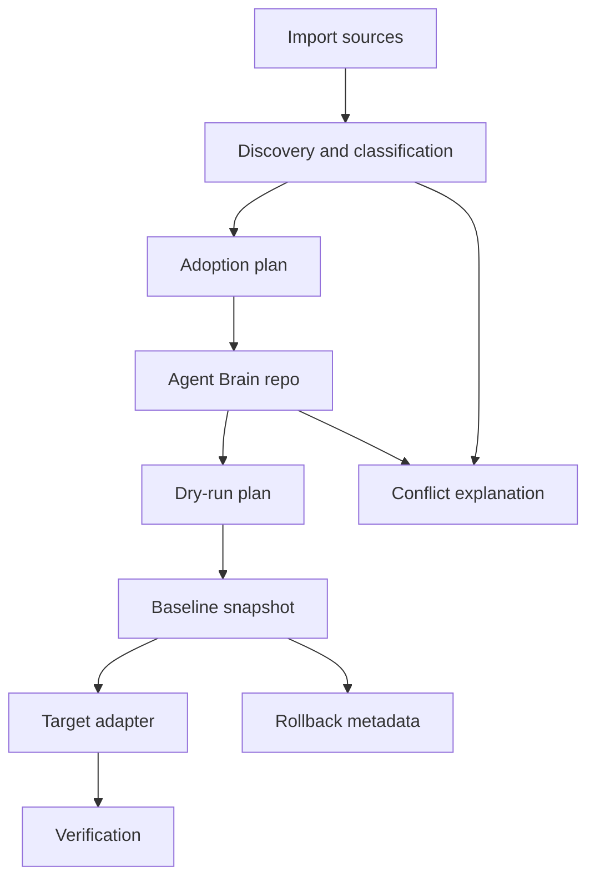

# Architecture

Agent Brain is a local CLI whose durable model is portable agent capability intent, not a copy of any one app's home directory. It imports, explains, and materializes coding-agent capabilities through a small canonical model plus replaceable target adapters.

Read this with the [README](../README.md), the [adapter contract](adapter-contract.md), and the [safety model](safety-model.md).

## Product Boundary

Agent Brain owns the portable source of truth for packages, profiles, provenance, exclusions, and target materialization locks. Local applications such as Claude Code and Codex remain execution surfaces.

Import sources and targets are deliberately different concepts:

| Surface | Role |
| --- | --- |
| Agent Brain repo | Canonical portable intent and generated target metadata. |
| Claude Code and Codex homes | Materialization targets with app-owned semantics. |
| dotstate, chezmoi, stow, bare dotfiles, home dirs | Import sources or legacy runtime state. |
| Runtime caches, histories, auth stores, generated schemas | Non-portable app-owned state unless explicitly overridden. |

This boundary keeps Agent Brain from becoming a generic dotfiles mirror. The product can start from a messy existing setup, but the target state is semantic and portable.

## Core Model

The core model is intentionally compact:

| Concept | Purpose |
| --- | --- |
| Package | A portable unit of agent capability source, such as a skill, plugin, prompt, MCP definition, or app connector intent. |
| Profile | A named selection of packages plus target adapter intent for a working setup. |
| Provenance | The import trail for a package or exclusion: source kind, source path, adapter, classification, confidence, and override state. |
| Exclusion | A durable explanation for material that should not become canonical source. |
| Materialization lock | The mapping from canonical package intent to generated paths in a target root, including hashes and adapter identity. |

The model is validated before target materialization. Profiles cannot reference missing packages, and non-portable classifications require explicit override before they can become package source.

## System Flow

The MVP is fixture-first: command behavior is exercised through filesystem ports and scannable fixtures before live app roots are used. That keeps discovery, import, apply, verify, rollback, and conflict explanation testable.

## Design Principles

- **Source is semantic.** A file becomes package source because it represents portable capability intent, not because it happens to be in a synced folder.
- **Targets are app-specific.** Claude Code and Codex can expose similar concepts through different layouts. Adapters preserve those differences.
- **Classification is conservative.** Unknown files, broken symlinks, unreadable paths, shared roots, and secret-like content are reported instead of silently adopted.
- **Mutation is transactional.** Live target writes go through dry-run, fingerprint confirmation, snapshot, scoped mutation, verification, and rollback metadata.
- **Reports serve humans and agents.** Commands return clear text by default and structured JSON when `--json` is requested.

## Extension Points

New capability types should first prove that they fit the package/profile/provenance model. New target apps should arrive as adapters, not as canonical model forks.

Good extension candidates:

- Additional coding-agent targets once Claude Code and Codex behavior is trustworthy.
- Richer package kinds for prompts, MCP servers, app connectors, and hook bundles.
- Stronger import detectors for dotfiles managers and unmanaged home roots.
- Better verification checks for generated target drift.

Bad extension candidates:

- Mirroring entire app homes into Agent Brain.
- Storing secrets, auth databases, histories, or runtime caches as packages.
- Encoding one app's current filesystem layout into durable package fields.

## Related Files

- [Adapter contract](adapter-contract.md)
- [Safety model](safety-model.md)
- [Agent handoff](agent-handoff.md)
- [Agent instructions](../AGENTS.md)
