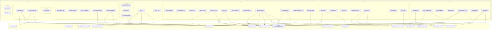

# Architecture Diagram

```mermaid
flowchart TD
  subgraph Core ["Core"]
    subgraph Core_adapters ["adapters"]
      src_adapters_claude_code_ts["[MOD] Claude Code"]
      src_adapters_codex_ts["[MOD] Codex"]
      src_adapters_index_ts["[MOD] Adapters/Index"]
    end
    subgraph Core_apply ["apply"]
      src_apply_dry_run_ts["[MOD] Dry Run"]
      src_apply_live_materializer_ts["[MOD] Live Materializer"]
      src_apply_materializer_ts["[MOD] Materializer"]
      src_apply_rollback_ts["[MOD] Rollback"]
      src_apply_snapshot_store_ts["[MOD] Snapshot Store"]
      src_apply_snapshot_ts["[MOD] Snapshot"]
      src_apply_verifier_ts["[MOD] Verifier"]
    end
      src_cli_ts["[MOD] Cli"]
      src_types_ts["[MOD] Types"]
    subgraph Core_commands ["commands"]
      src_commands_apply_ts["[MOD] Apply"]
      src_commands_bootstrap_ts["[MOD] Bootstrap"]
      src_commands_doctor_ts["[MOD] Doctor"]
      src_commands_explain_conflict_ts["[MOD] Explain Conflict"]
      src_commands_import_ts["[MOD] Import"]
      src_commands_rollback_ts["[MOD] Rollback"]
      src_commands_verify_ts["[MOD] Verify"]
    end
    subgraph Core_conflict ["conflict"]
      src_conflict_explain_ts["[MOD] Explain"]
    end
    subgraph Core_core ["core"]
      src_core_classification_ts["[MOD] Classification"]
      src_core_display_path_ts["[MOD] Display Path"]
      src_core_fs_port_ts["[MOD] Fs Port"]
      src_core_git_port_ts["[MOD] Git Port"]
      src_core_live_fs_port_ts["[MOD] Live Fs Port"]
      src_core_model_ts["[MOD] Model"]
      src_core_path_safety_ts["[MOD] Path Safety"]
      src_core_provenance_ts["[MOD] Provenance"]
      src_core_repo_reader_ts["[MOD] Repo Reader"]
      src_core_repo_writer_ts["[MOD] Repo Writer"]
      src_core_scannable_fixture_ts["[MOD] Scannable Fixture"]
      src_core_sync_status_ts["[MOD] Sync Status"]
    end
    subgraph Core_import ["import"]
      src_import_adoption_plan_ts["[MOD] Adoption Plan"]
      src_import_brain_writer_ts["[MOD] Brain Writer"]
      src_import_live_scanner_ts["[MOD] Live Scanner"]
      src_import_source_detectors_ts["[MOD] Source Detectors"]
      src_import_source_reader_ts["[MOD] Source Reader"]
    end
    subgraph Core_materialize ["materialize"]
      src_materialize_lock_store_ts["[MOD] Lock Store"]
      src_materialize_target_planner_ts["[MOD] Target Planner"]
    end
    subgraph Core_reporting ["reporting"]
      src_reporting_json_ts["[MOD] Json"]
      src_reporting_text_ts["[MOD] Text"]
    end
  end
  subgraph External ["External"]
      input["[EXT] input"]
      node_crypto["[EXT] node:crypto"]
      node_fs["[EXT] node:fs"]
      node_path["[EXT] node:path"]
      node_url["[EXT] node:url"]
      readAgentBrainRepo["[EXT] readAgentBrainRepo"]
      readRepoManifest["[EXT] readRepoManifest"]
      renderJsonReport["[EXT] renderJsonReport"]
      renderTextReport["[EXT] renderTextReport"]
      repo["[EXT] repo"]
      repoFromPlan["[EXT] repoFromPlan"]
      repoWrite["[EXT] repoWrite"]
      validateAgentBrainRepo["[EXT] validateAgentBrainRepo"]
      writeBrainRepo["[EXT] writeBrainRepo"]
      writeRepoFiles["[EXT] writeRepoFiles"]
  end
  src_apply_dry_run_ts --> node_crypto
  src_apply_live_materializer_ts --> node_fs
  src_apply_live_materializer_ts --> node_path
  src_apply_snapshot_store_ts --> node_fs
  src_apply_snapshot_store_ts --> node_path
  src_apply_snapshot_store_ts --> writeRepoFiles
  src_apply_verifier_ts --> node_crypto
  src_apply_verifier_ts --> node_path
  src_apply_verifier_ts --> repo
  src_cli_ts --> node_fs
  src_cli_ts --> node_url
  src_cli_ts --> renderJsonReport
  src_cli_ts --> renderTextReport
  src_commands_apply_ts --> node_path
  src_commands_apply_ts --> readAgentBrainRepo
  src_commands_import_ts --> repoWrite
  src_commands_import_ts --> writeBrainRepo
  src_commands_import_ts --> writeRepoFiles
  src_commands_verify_ts --> repoFromPlan
  src_core_live_fs_port_ts --> node_fs
  src_core_live_fs_port_ts --> node_path
  src_core_model_ts --> node_path
  src_core_model_ts --> repo
  src_core_path_safety_ts --> node_path
  src_core_repo_reader_ts --> node_fs
  src_core_repo_reader_ts --> node_path
  src_core_repo_reader_ts --> readRepoManifest
  src_core_repo_reader_ts --> repo
  src_core_repo_reader_ts --> validateAgentBrainRepo
  src_core_repo_writer_ts --> node_fs
  src_core_repo_writer_ts --> node_path
  src_core_scannable_fixture_ts --> node_fs
  src_core_sync_status_ts --> repo
  src_import_source_detectors_ts --> node_path
  src_import_source_reader_ts --> node_fs
  src_import_source_reader_ts --> node_path
  src_materialize_lock_store_ts --> node_fs
  src_materialize_lock_store_ts --> node_path
  src_materialize_lock_store_ts --> writeRepoFiles
  src_materialize_target_planner_ts --> input
  src_materialize_target_planner_ts --> node_path

```